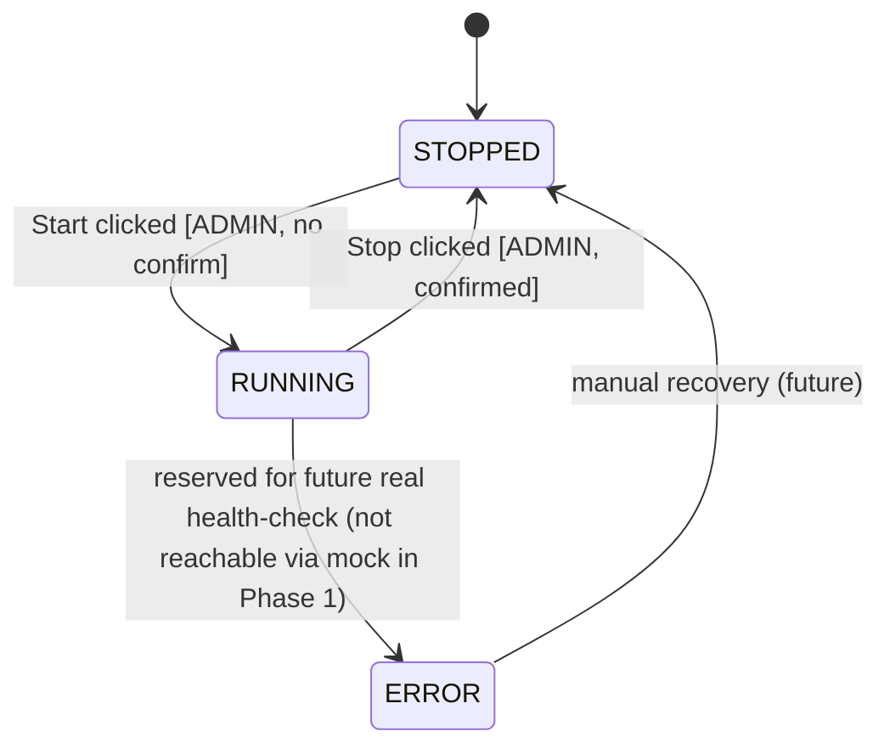

# SPEC.md — BPL Order Engine Admin

| | |
|---|---|
| **Repository** | `BPL-Order-Engine-Admin` |
| **Status** | v0.2 (audit pass against the actual repo) |
| **Owner** | QA Intern (technical owner); this is the in-house "Commlink" admin project |
| **Backend** | Spring Boot **4.1.1** · Gradle **9.7.1** (wrapper) · Java **17** · `spring-boot-starter-webmvc` + `spring-boot-starter-security` + Lombok |
| **Frontend** | Vite · React 19 · TypeScript 6 (no router this phase) |
| **Presentation** | Wed Sep 2, 2026, 11:00 AM |
| **Last updated** | Aug 29, 2026 |

**Related project docs:** TL task assignment (verbatim), internal stack-comparison memo, draft development plan, Claude Code study guide. This SPEC.md supersedes those docs wherever they conflict — most notably, the stack is **Spring Boot + Vite/React**, not Next.js/Node, and extensibility is a **Factory Method over hardcoded per-engine implementations**, not a dynamic plugin system.

> **Repo-vs-spec reconciliation note (added in v0.2):**
> - The actual Java package is `com.BPL_Order_Engine_Admin.manager` (used in source), but the Gradle `group` in `build.gradle` is still the Initializr default `com.example`. The Gradle `group` should be changed to `com.BPL_Order_Engine_Admin` before the first release. This is cosmetic for Phase 1 (no published artifact yet) but is recorded here so it isn't forgotten.
> - The UI directory on disk is `BPL-Order_Engine-Admin_ui/` (underscore before `Engine`, hyphen before `Admin_ui`). The backend uses all hyphens (`BPL-Order-Engine-Admin-backend/`). The mismatch is real; we keep the on-disk spelling in this SPEC and references throughout use the same spelling.
> - The Vite scaffold's `src/App.tsx` has been replaced wholesale by `AppShell` (which branches on `auth: AuthState | null` from `AuthContext`); the `assets/` folder (hero.png, react.svg, vite.svg) was removed alongside it. See §4.1.

> **Known deviations from this spec (added in v0.2):**
>
> The following items describe the **actual state of the repo at the time of the v0.2 audit** — not the design intent laid out in the sections below. They are pinned here so a reader does not have to reverse-engineer them from the code or from git history. Earlier drafts of this spec (and the codebase that grew up around them) described things differently; the commits `4b02abd` (initial) → `3c364d2` (SPEC + .claude tools sync) carry that evolution.
>
> - **Auth is HTTP Basic against in-memory users, not a token-based `/api/auth/login` flow.** §3.2 below is the *current* spec and matches the code. The earlier design had a `POST /api/auth/login` that returned an opaque UUID bearer token, with `AuthController`, `AuthService`, `TokenAuthFilter`, and a `ConcurrentHashMap`-backed `TokenStore` under `manager/auth/`. None of that was ever implemented — no `AuthController` or `TokenStore` class exists in the repo. §3.2 was rewritten in `3c364d2` to match the actual code (HTTP Basic, two seeded users `admin`/`admin123` and `viewer`/`viewer123`, `STATELESS` session, no server-side logout).
>
> - **Hook config lives only in `.claude/settings.json`.** §2.5 describes one active hook (`guard-staging.sh`, `PreToolUse` on `Bash`, exit 2 on match) and that is the only hook that fires. An earlier draft had a second hook under `.claude/config.json` (matcher `.*`) calling `pre-tool-use.sh` — both files were removed in `3c364d2`. Claude Code does not read hooks from `config.json` regardless, so any future "second layer of protection" must live in `settings.json`, not `config.json`. See §2.5.

---

## 1. Executive Summary

BPL Order Engine Admin is a small internal web application that lets BPL admins **see, start, stop, and monitor** the BPL Order Engine through a browser instead of shelling into infrastructure directly. The app has a single Login screen and an authenticated dashboard — one `DashboardLayout` rendering Status, Controls, and Logs as three cards in a single grid. There is no client-side router, no top-bar nav, and no `screen` state; all three protected views are co-rendered, with role-based gating (Controls is read-only for VIEWER) handled inside each card.

1. **Login** — credential entry. Auth is HTTP Basic against two seeded in-memory users (`admin`/`admin123` → ADMIN, `viewer`/`viewer123` → VIEWER); the client re-sends `Authorization: Basic <base64(username:password)>` on every request.
2. **Status card** — current engine state (`RUNNING` / `STOPPED` / `ERROR`), polled every 3 s.
3. **Controls card** — admin-only Start/Stop, with confirmation before stopping. VIEWER sees a read-only notice.
4. **Logs card** — recent log lines for the engine, viewable by any authenticated user; polled every 5 s.

There is exactly one engine (`bpl`), its "control plane" is an **in-memory mock state machine** rather than the real staging container, and the architecture exists to make adding a second engine (`pcl`) a matter of writing one new class — not to make the current phase dynamic or configurable.

**Hard constraint carried through every section below:** the real `bpl-order-engine` container at `180.210.129.233` is live staging infrastructure shared with the JMeter integration suite. Nothing in this phase issues real start/stop/docker commands against it. This is enforced at three layers — the code (mock-only implementation), a Claude Code hook (`.claude/hooks/guard-staging.sh`), and a Claude Code skill (`.claude/skills/staging-safety/SKILL.md`) — and any future change to that must be an explicit, separate, human-approved decision (see §5.2).

### Out of scope this phase
Real container integration · persistent/DB-backed user accounts · password reset flows · audit logging of admin actions · CI/CD pipeline · PCL implementation (interface only, no working `pcl` class yet — see §5.1). Broader deferred items are listed in §5.3.

---

## 2. Architecture & Design Patterns

### 2.1 Repository layout (as it actually exists on disk)

```
BPL-Order-Engine-Admin/
├── SPEC.md
├── .gitignore
├── .claude/
│   ├── settings.json                 # committed — guardrail hook config + defaultMode=plan
│   ├── settings.local.json           # gitignored — local model/API config only
│   ├── hooks/guard-staging.sh        # PreToolUse on Bash, blocks staging references
│   ├── skills/staging-safety/SKILL.md
│   ├── skills/add-engine-impl.md
│   └── agents/
│       ├── backend-agent.md          # implements backend against this SPEC
│       └── qa-reviewer.md            # read-only reviewer, flags staging/spec drift
├── BPL-Order-Engine-Admin-backend/   # Spring Boot 4.1.1, Gradle 9.7.1, Java 17
│   ├── build.gradle                  # deps: webmvc + security + lombok
│   ├── settings.gradle               # rootProject.name = BPL-Order-Engine-Admin-backend
│   ├── gradle/wrapper/               # gradle-wrapper.jar + .properties (9.7.1)
│   ├── gradlew, gradlew.bat
│   └── src/
│       ├── main/java/com/BPL_Order_Engine_Admin/manager/
│       │   └── BplOrderEngineAdminBackendApplication.java   # Spring Boot main
│       ├── main/resources/application.properties             # only spring.application.name today
│       └── test/java/com/BPL_Order_Engine_Admin/manager/
│           └── BplOrderEngineAdminBackendApplicationTests.java  # @SpringBootTest contextLoads only
└── BPL-Order_Engine-Admin_ui/        # Vite 8 + React 19 + TypeScript 6 (note: underscore)
    ├── package.json
    ├── tsconfig.json, tsconfig.app.json, tsconfig.node.json
    ├── vite.config.ts
    ├── eslint.config.js
    ├── index.html
    ├── public/                       # favicon.svg, icons.svg
    └── src/
        ├── main.tsx                  # createRoot + StrictMode
        ├── App.tsx                   # **Vite scaffold placeholder** — to be replaced
        ├── App.css, index.css
        └── assets/                   # hero.png, react.svg, vite.svg (all to be removed)
```

### 2.2 Design patterns

| Pattern | Where | Why |
|---|---|---|
| **Strategy / common interface** | `OrderEngineOperations` | One contract (`engineId`, `displayName` (default returns `engineId`), `status`, `start`, `stop`, `getLogs`) implemented identically by every engine type. |
| **Factory Method (registry-backed)** | `OrderEngineFactory` | Resolves an `OrderEngineOperations` by `engineId` string. Backed by Spring's `Map<String, OrderEngineOperations>` autowiring — every `@Service("<engineId>")` bean is picked up automatically by name, so adding an engine never touches the factory or controller. On miss, throws `EngineNotSupportedException` → handled by `@ControllerAdvice` → **404** with the standard error envelope. |
| **Hardcoded strategy implementation** | `BplOrderEngineOperations` | Per TL's instruction, control logic is intentionally hardcoded per engine, not generic/config-driven. The mock is the entire implementation for Phase 1. |
| **In-memory state machine** | Inside `BplOrderEngineOperations` | `AtomicReference<EngineStatus>` guarded by a `ReentrantLock` for start/stop transitions; no external process, container, or network call involved. |
| **HTTP Basic auth** | `SecurityConfig` | `InMemoryUserDetailsManager` + `BCryptPasswordEncoder`; `STATELESS` session; every request re-sends `Authorization: Basic <base64(username:password)>`. No login endpoint, no tokens, no server-side session. |

### 2.3 Backend package structure (target)

Base package: `com.BPL_Order_Engine_Admin.manager`

```
manager/
├── BplOrderEngineAdminBackendApplication.java
├── engine/
│   ├── OrderEngineOperations.java # interface: engineId(), displayName(), status(), start(), stop(), getLogs(int)
│   ├── OrderEngineFactory.java    # Factory Method / registry lookup by engineId; throws EngineNotSupportedException
│   ├── EngineStatus.java          # enum: RUNNING, STOPPED, ERROR
│   ├── EngineNotSupportedException.java
│   ├── LogLine.java               # record/timestamp/level/message
│   ├── dto/ (EngineStatusResponse, EngineActionResponse, LogLineResponse, LogPageResponse)
│   ├── bpl/
│   │   └── BplOrderEngineOperations.java  # @Service("bpl") — in-memory mock
│   └── pcl/
│       └── (no class yet — absence is the contract; see §5.1)
├── web/
│   ├── OrderEngineController.java # /api/engines/{engineId}/**
│   └── ApiExceptionHandler.java   # @ControllerAdvice → standard error envelope
└── config/
    ├── SecurityConfig.java        # HTTP Basic; InMemoryUserDetailsManager (admin, viewer); BCrypt; STATELESS session
    └── CorsConfig.java            # permits http://localhost:5173 → :8080 in dev with allowCredentials=true
```

`build.gradle` notes (verbatim from the scaffold):
- `org.springframework.boot:spring-boot-starter-security`
- `org.springframework.boot:spring-boot-starter-webmvc`  ← Spring Boot 4.x artifact name
- `org.projectlombok:lombok` (compile-only + annotation processor)

**No JPA, no `spring-boot-starter-validation`, no JWT lib, no actuator** are pulled in. Auth is `spring-boot-starter-security` only — the two seeded users and the BCrypt encoder are defined inline in `config/SecurityConfig.java` (no separate `UserDetailsService` or token filter). If we later want bean validation, we add `spring-boot-starter-validation` and document it here.

### 2.4 The mock state machine (concrete)

`BplOrderEngineOperations` never calls Docker, SSH, or HTTP against `180.210.129.233`. It holds:

- `EngineStatus status` — starts at `STOPPED` on application boot.
- `Instant lastTransitionAt` — set on every successful start/stop; null only before the first transition.
- `Deque<LogLine> logBuffer` — a bounded ring buffer holding the **last 500** entries (oldest evicted). Seeded at construction time with **3 canned lines**:
  1. `INFO  "Engine initialized (mock)."`
  2. `INFO  "Awaiting start command."`
  3. `INFO  "Pre-start health check passed."`
- A `@Scheduled(fixedDelay = 2000)` task that, **only while `status == RUNNING`**, appends a synthetic log line (e.g., `INFO  "Heartbeat OK (mock tick #<n>)"`). When `status == STOPPED`, the scheduler is a no-op. When `status == ERROR` (unreachable in Phase 1, see below), behavior is reserved for §5.2.

Transitions (guarded by a `ReentrantLock`):
- `start()`: `STOPPED → RUNNING`. If already `RUNNING`, throws `IllegalStateException` → handled by `@ControllerAdvice` → **409 Conflict**, no-op.
- `stop()`: `RUNNING → STOPPED`. If already `STOPPED`, throws `IllegalStateException` → **409 Conflict**, no-op.
- `ERROR` exists in the enum and UI but is **not reachable** by any mock action in Phase 1 — it's reserved so the contract already supports a future real health-check reporting failure (see §5.2), and so the frontend's error-state styling is built and demoable now.

`displayName()` returns `"BPL Order Engine"`. (Other engines override it; see §5.1 step 2 for the PCL example.)

### 2.5 Safety guardrail (non-negotiable for this phase)

| Layer | Mechanism | What it does |
|---|---|---|
| Code | `BplOrderEngineOperations` is the *only* implementation of `bpl` | Structurally cannot reach staging — there is no network client to remove. |
| Hook | `.claude/hooks/guard-staging.sh` (`PreToolUse` on `Bash`) | Blocks any shell command whose input mentions `180.210.129.233` or `bpl-order-engine`, in every permission mode, before it runs. Exit code `2` = block. |
| Skill | `.claude/skills/staging-safety/SKILL.md` | Tells the agent, in plain language, to stop and ask before anything that could touch staging. |
| Defaults | `application.properties` ships with **no** staging URL or credentials | Nothing is one grep away from being live. |

Any future work that intentionally wires a real integration must update all four layers above in one change — see §5.2.

---

## 3. API Contracts

### 3.1 Conventions

- Base path: `/api`.
- Default server port: **8080** (Spring Boot default; `application.properties` is otherwise empty).
- Auth: HTTP Basic. See §3.2 for users, error mapping, and dev CORS.
- Content type: `application/json` throughout request and response.
- Timestamps: ISO-8601 UTC (e.g., `2026-08-29T09:15:44Z`).
- `engineId` is a path segment (`bpl` today; `pcl` once §5.1 lands) — this is what makes the API shape already multi-engine-ready without a selector UI existing yet.
- **Error envelope** (all 4xx/5xx responses), fields pinned:
  - `timestamp` — server time, ISO-8601 UTC.
  - `status` — integer HTTP status code.
  - `error` — the standard HTTP reason phrase, e.g., `Conflict`, `Unauthorized`, `Not Found`, `Bad Request`, `Forbidden`, `Internal Server Error`.
  - `message` — human-readable, safe to surface in the UI.
  - `path` — the request URI as received (e.g., `/api/engines/bpl/start`).

```json
{
  "timestamp": "2026-08-29T09:02:11Z",
  "status": 409,
  "error": "Conflict",
  "message": "Engine 'bpl' is already RUNNING",
  "path": "/api/engines/bpl/start"
}
```

### 3.2 Authentication

There is no `/api/auth/login` or `/api/auth/logout` endpoint. Auth is
HTTP Basic, validated by Spring Security's `InMemoryUserDetailsManager`
in `config/SecurityConfig.java`:

- Two seeded users, BCrypt-hashed, defined in
  `SecurityConfig.userDetailsService(...)`:
  - `admin` / `admin123` → role `ADMIN`
  - `viewer` / `viewer123` → role `VIEWER`
- Every request to `/api/**` must carry
  `Authorization: Basic <base64(username:password)>`.
- Sessions are `STATELESS` — the server holds no session; the client
  re-sends credentials on every request. There is no token, no TTL, no
  expiry, and no server-side logout.
- Missing or malformed `Authorization` header on a protected endpoint
  → **401** with the standard error envelope,
  `"message": "Authentication required"`. The custom
  `authenticationEntryPoint` in `SecurityConfig` writes this body
  directly (no `WWW-Authenticate: Basic` challenge header) so the
  SPA gets a parseable body.
- Valid credentials but insufficient role for the endpoint
  → **403** with the standard error envelope, `"message": "Access denied"`.
- `GET /error` is the only path under `/api/**` permitted without
  auth, so the dispatcher can map `401`/`403` into the standard error
  envelope.

In the dev environment the Vite origin (`http://localhost:5173`) is
allowed via `config/CorsConfig.java` with `allowCredentials=true`, so
the SPA can include the `Authorization` header on cross-origin XHR.
When this app is deployed behind a real frontend domain, update the
allowed-origins list in `CorsConfig` accordingly.

### 3.3 Engine endpoints

**`GET /api/engines/{engineId}/status`** — roles: `ADMIN`, `VIEWER`

Response `200 OK`:
```json
{
  "engineId": "bpl",
  "displayName": "BPL Order Engine",
  "status": "RUNNING",
  "lastTransitionAt": "2026-08-29T09:02:11Z",
  "checkedAt": "2026-08-29T09:15:44Z"
}
```

`displayName` is sourced from `OrderEngineOperations.displayName()` (the interface method, not a config lookup). `lastTransitionAt` is `null` if no transition has occurred yet — the field is omitted in JSON in that case (`@JsonInclude(NON_NULL)`). `checkedAt` is the server clock at the moment the controller built the response (`Instant.now()` in `OrderEngineController.status`), not a property of the engine.

**`POST /api/engines/{engineId}/start`** — roles: `ADMIN` only

Response `200 OK`:
```json
{
  "engineId": "bpl",
  "displayName": "BPL Order Engine",
  "status": "RUNNING",
  "message": "BPL Order Engine started (mock).",
  "transitionedAt": "2026-08-29T09:02:11Z"
}
```

Response `409 Conflict` if already `RUNNING`. Response `403 Forbidden` if caller is `VIEWER`.

**`POST /api/engines/{engineId}/stop`** — roles: `ADMIN` only

Same response shape as `start`, with `status: "STOPPED"` and `message: "BPL Order Engine stopped (mock)."`. `409 Conflict` if already `STOPPED`.

**`GET /api/engines/{engineId}/logs?limit=100`** — roles: `ADMIN`, `VIEWER`

Query params:
- `limit` (optional, integer, default `100`, valid values `50`, `100`, `200`). Out-of-range or non-integer → **400** with `"message": "limit must be one of 50, 100, 200"`.

Response `200 OK`:
```json
{
  "engineId": "bpl",
  "limit": 100,
  "count": 42,
  "lines": [
    { "timestamp": "2026-08-29T09:10:00Z", "level": "INFO", "message": "Order queue drained: 12 orders processed" },
    { "timestamp": "2026-08-29T09:10:05Z", "level": "INFO", "message": "Heartbeat OK" }
  ]
}
```

`lines` is ordered oldest → newest and capped at `limit` items. `count` is the actual number returned (≤ `limit`).

**`GET /api/engines/{engineId}` with unknown `engineId`** (e.g. `pcl` before §5.1 lands) → `404 Not Found`, `"message": "Engine 'pcl' is not supported yet"`. This is driven by `OrderEngineFactory.get(engineId)` throwing `EngineNotSupportedException` and `@ControllerAdvice` mapping it.

### 3.4 Role matrix

| Endpoint | ADMIN | VIEWER |
|---|:---:|:---:|
| `GET /api/engines/{id}/status` | ✅ | ✅ |
| `POST /api/engines/{id}/start` | ✅ | ❌ (403) |
| `POST /api/engines/{id}/stop` | ✅ | ❌ (403) |
| `GET /api/engines/{id}/logs` | ✅ | ✅ |

Auth-failure status codes (401 missing/malformed credentials, 403 insufficient role) and their exact message strings are defined in §3.2.

---

## 4. UI & State Flow

### 4.1 Screen inventory

No client-side router is added this phase — `package.json` currently only depends on `react`/`react-dom`. A top-level `AppShell` reads `auth: AuthState | null` from `AuthContext` (see `auth/AuthContext.tsx`) and renders the Login screen when `auth === null`, otherwise the `DashboardLayout` — a single grid of three cards (`StatusCard`, `ControlPanel`, `LogTerminal`). There is no `screen` state, no top-bar nav, and no client-side router; all three authenticated views are co-rendered, with role-based gating (Controls is read-only for VIEWER) handled inside each card. `AuthState = { username, role, authorizationHeader }` — the base64-encoded `username:password`, **not** a token, because HTTP Basic has no tokens. The `AuthProvider` rehydrates from `localStorage[bpl-admin-auth-v1]` on mount and re-persists on every change, so a page refresh doesn't force re-entry.

The Vite scaffold's `src/App.tsx` is replaced wholesale by `AppShell`; the `assets/` folder (hero.png, react.svg, vite.svg) is removed.

| Screen / Card | Auth required | Roles | Notes |
|---|:---:|---|---|
| Login | No | — | direct URL, or auto-render when no persisted `AuthState` is rehydrated from `localStorage` |
| Status card | Yes | ADMIN, VIEWER | always visible in the dashboard grid |
| Controls card | Yes | ADMIN (VIEWER sees a read-only notice, no API call) | always visible in the dashboard grid; rendered read-only for VIEWER |
| Logs card | Yes | ADMIN, VIEWER | always visible in the dashboard grid |
| (header bar) | Yes | ADMIN, VIEWER | shows current user + role + **Sign out** button; on every authenticated screen. Sign out is **client-side only** — there is no server logout endpoint and no session to invalidate under HTTP Basic; the button just calls `signOut()` in `AuthContext`, which clears the persisted `AuthState` from `localStorage` and returns the user to the Login screen. |

### 4.2 Screen-by-screen breakdown

**Login**
- See §3.2 for the auth contract (HTTP Basic, in-memory users). Submitting the form calls `AuthProvider.signIn(username, password)` (client-side match against `DEMO_USERS`); the rest of this subsection is the per-screen behavior on top of that contract.
- Fields: username, password. The Login screen also has two **Quick sign-in** buttons ("Login as Admin" / "Login as Viewer") that pre-fill the seeded credentials from `DEMO_USERS` and submit in one click.
- Success: `AuthProvider.signIn(username, password)` matches the input against the in-memory `DEMO_USERS` (client-side check, no server round-trip) and stores `AuthState = { username, role, authorizationHeader }` in `AuthContext`, where `authorizationHeader = btoa("<username>:<password>")`. (The raw password is never persisted, never held in the React tree, and never logged.)
- Failure (no 400/401 from a login endpoint — credentials are validated per request by Spring Security on the first engine call):
  - Client-side mismatch in `signIn(...)` (unknown username or wrong password) → inline error `"Invalid username or password"`, stay on Login, password field cleared, `AuthState` unchanged.
  - `401` from any engine request → inline error `"Invalid username or password"`, stay on Login, password field cleared. (The current code surfaces the 401 inline; it does **not** auto-clear stored credentials or auto-redirect — see §4.3.)
  - Network/5xx → inline error `"Unable to reach the server. Try again."`, stay on Login.
- Loading state: submit button disabled and shows `"Signing in…"` while the first authenticated request is in flight; username/password fields are also disabled.

**Status**
- On mount: `GET /api/engines/bpl/status`.
- Auto-refresh every **3 s** via `usePolling(..., 3000, true, ...)` (one `setTimeout`-driven loop, cleared on unmount).
- Displays a colored badge (`RUNNING` green = `--color-running`, `STOPPED` red = `--color-stopped`, `ERROR` amber = `--color-error` — see `index.css` for the exact tokens) and `lastTransitionAt` (formatted as local time; or `"—"` if null).
- Loading state (first load): plain text `"Loading status…"` (no spinner) inside the card body, no badge.
- Error state: an inline error block `"Could not load status: <message>"` (not dismissible; the next 3-s poll will replace it on success or update the message on continued failure). No explicit Retry button — `usePolling` continues firing in the background.

**Start/Stop Controls**
- ADMIN only. VIEWER sees `"You don't have permission to control the engine"` inline; **no API call attempted**.
- Shows current status (same source as the Status card) + two buttons:
  - **Start** — disabled if `status === RUNNING`; click → `POST /api/engines/bpl/start`.
  - **Stop** — disabled if `status === STOPPED`; click → confirmation prompt.
- **Stop confirmation**: `window.confirm('Stop BPL Order Engine? Polling and logs will pause until you start it again.')` — a native browser OK/Cancel dialog, not a custom React modal. Confirm fires the request.
- On click (Start or confirmed Stop): button enters loading state, label becomes `"Starting…"` / `"Stopping…"`, request fires.
  - `200` → success toast `"BPL Order Engine started (mock)."` / `"BPL Order Engine stopped (mock)."` for **3 s**; local status is updated from the response and the Status card's next poll picks it up.
  - `409` → inline text `"Already in that state — refreshing status."` and the Status card re-fetches `/status` immediately.
  - `403` (should not happen for ADMIN; defensive) → error banner `"You don't have permission to do that."`.
  - Any other error → inline error block `"Could not <action> engine: <message>"`.

**Logs**
- ADMIN and VIEWER. On mount: `GET /api/engines/bpl/logs?limit=100`.
- Auto-refresh every **5 s** via `usePolling(..., 5000, true, ...)` (slower than the Status card's 3 s so the two polls don't compete).
- Limit selector: `50` / `100` / `200`, default `100`. Changing the selector re-fetches.
- Scrollable panel, auto-scrolled to bottom on load and on each refresh (only if the user is already at the bottom — see `useEffect` in `LogTerminal`).
- Loading state: no spinner and no explicit text. While the first fetch is in flight the log area is empty and the header shows `"…"` for the line count; once the first response arrives the lines render (or the empty-state message if `count === 0`).
- Empty state: `"No log lines yet — engine is STOPPED."` (rendered when `lines.length === 0`; in practice the mock's `@PostConstruct` seed means this is never visible in Phase 1, but the message is in the code as a defensive fallback).
- Error state: an inline error block `"Could not load logs: <message>"` (not dismissible; the next 5-s poll will replace it on success). No explicit Retry button — `usePolling` continues firing in the background.

### 4.3 Global state flow

```mermaid
stateDiagram-v2
    [*] --> Unauthenticated
    Unauthenticated --> Authenticated: submit credentials (client-side match in AuthContext.signIn) or Quick sign-in
    Authenticated --> Unauthenticated: user clicks "Sign out" in the dashboard header (client-side only; clears localStorage)
    Authenticated --> Authenticated: page refresh rehydrates from localStorage[bpl-admin-auth-v1] (no re-entry)
```



> **TODO (spec'd but not yet wired):** when *any* engine API returns
> 401 mid-session, the client should clear the stored `AuthState` and
> redirect to the Login screen with a banner (e.g. `"Authentication
> required"`). Today `api.ts:request()` throws `ApiError` and each
> screen renders an inline error; nothing in the auth or API layer
> catches 401 globally to call `signOut()` and bounce to Login. This
> transition is desirable for Phase 2 — stale credentials from
> `localStorage` after the backend is restarted with different seeds
> would otherwise keep the user on a perpetually-erroring dashboard.

### 4.4 Engine state (as reflected in the UI)



The Logs card can lag the true mock state by up to one refresh interval — acceptable for an internal tool. The Status card's 3 s poll (documented in §4.2) is what keeps the user oriented between actions.

---

## 5. Future Extensibility

### 5.1 Adding the PCL Order Engine

This is the extensibility story the architecture exists to prove. The factory's contract is:

```java
public interface OrderEngineFactory {
    /** @throws EngineNotSupportedException if no bean is registered for {@code engineId}. */
    OrderEngineOperations get(String engineId);
}
```

PCL landing steps — **none of these touch the controller, factory, `SecurityConfig`, or `OrderEngineOperations` interface**:

1. Create `com.BPL_Order_Engine_Admin.manager.engine.pcl.PclOrderEngineOperations implements OrderEngineOperations`, annotated `@Service("pcl")`.
2. Implement `displayName()` (return `"PCL Order Engine"`) and `status()/start()/stop()/logs(int)` — an in-memory mock first (mirrors §2.4), swapped for a real integration only once that's independently approved, same as §5.2.
3. **No stub class is needed beforehand.** Before step 1, no bean named `pcl` exists, so `OrderEngineFactory.get("pcl")` throws `EngineNotSupportedException` and the controller returns **404** with the message in §3.3. That is the *correct* Phase-1 behavior — adding a stub that throws "not implemented" would only hide bugs.
4. **No changes needed** to `OrderEngineFactory` or `OrderEngineController` — Spring's `Map<String, OrderEngineOperations>` injection discovers the new bean by name automatically.
5. Frontend: extend the (currently hardcoded) engine reference from `"bpl"` to a small dropdown/list; reuse every existing API client function with `engineId="pcl"`.
6. Optional: add `GET /api/engines` returning `[{ "engineId", "displayName" }, ...]` so the frontend renders options dynamically. Implementation choice (extend the factory with an `engines()` method, or a separate `EngineRegistry` bean) deferred until the second engine is actually being added.
7. Update this SPEC.md and re-run the `qa-reviewer` sub-agent against the diff.

### 5.2 Replacing the BPL mock with the real staging engine

**Do not start this without explicit, separate confirmation** — the container is shared with the JMeter integration suite and an accidental start/stop can break someone else's test run.

1. Confirm the integration path in writing (management API on the container? SSH + script? something else?) before writing any code.
2. Add a new class, e.g. `BplLiveOrderEngineOperations implements OrderEngineOperations`, registered as `@Service("bpl")` but **only under a dedicated Spring profile** (e.g. `live-bpl`) — `@Profile("live-bpl")` on the class. `BplOrderEngineOperations` (the mock) stays the default, CI-safe implementation by being annotated `@Profile("!live-bpl")`. Without an explicit profile, the mock wins — this is the safe default.
3. Real calls live only inside `BplLiveOrderEngineOperations`; the controller and frontend need no changes (see also §5.1 step 4 for the equivalent rule when adding a new engine type).
4. Any integration tests against the real engine run only under the `live-bpl` profile, never by default — CI and JMeter stay unaffected. Test files are placed under `src/test/java/.../live/` and gated by `@ActiveProfiles("live-bpl")` so `gradle test` does not pick them up.
5. Update `.claude/hooks/guard-staging.sh` and `.claude/skills/staging-safety/SKILL.md` to reflect the newly-approved path **after** it's live, not before — the guardrail must not be the first thing to know about a real integration.
6. Roll out behind the profile/flag to a small group first; the mock remains an instant rollback by removing the profile.

### 5.3 Explicitly deferred (not this phase)

Persistent/DB-backed user accounts and password reset · real-time log streaming (SSE/WebSocket) in place of polling · rotating/refreshable tokens · per-user rate limiting · audit logging of who started/stopped what and when · user-management admin UI · metrics export (Prometheus) · observability for the admin app itself · a general-purpose dynamic plugin system (intentionally rejected in favor of the hardcoded-per-engine approach the TL asked for) · CI/CD pipeline and containerized deployment of this admin app itself.
