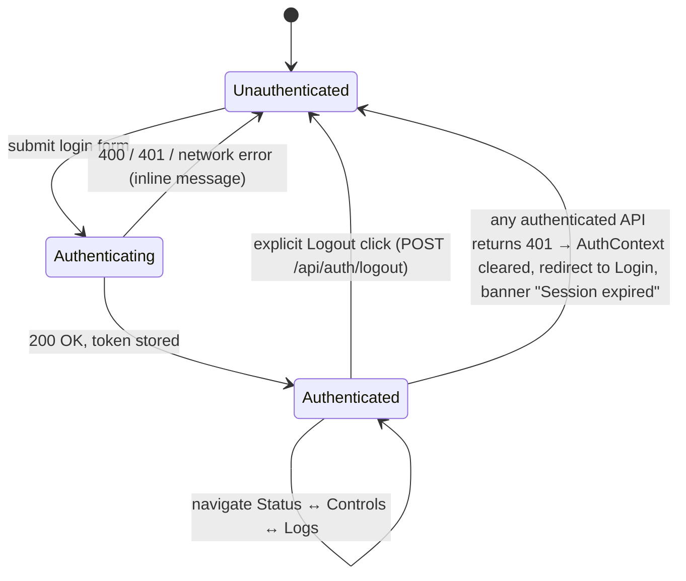
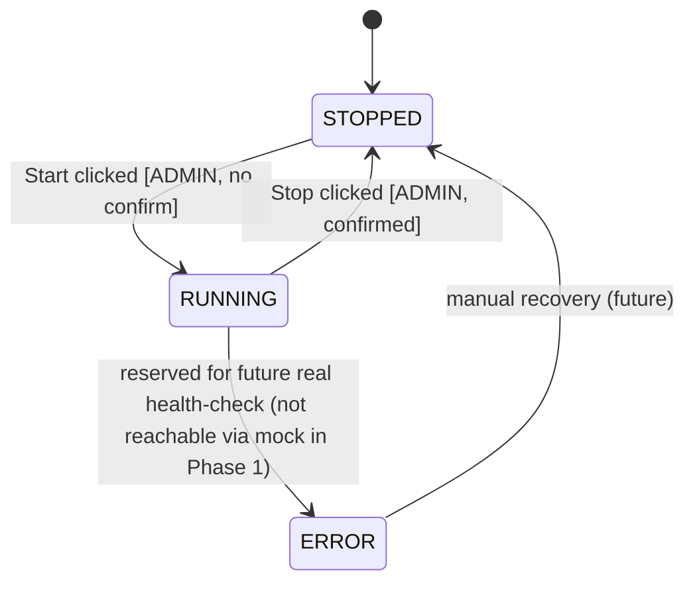

# SPEC.md — BPL Order Engine Admin

| | |
|---|---|
| **Repository** | `BPL-Order-Engine-Admin` |
| **Status** | v0.2 (audit pass against the actual repo) |
| **Owner** | QA Intern (technical owner); this is the in-house "Commlink" admin project |
| **Backend** | Spring Boot **4.1.1** · Gradle **9.7.1** (wrapper) · Java **17** · `spring-boot-starter-webmvc` + `spring-boot-starter-security` + Lombok |
| **Frontend** | Vite · React 19 · TypeScript 6 (no router this phase) |
| **Presentation** | Wed Sep 2, 2026, 11:00 AM |
| **Last updated** | Aug 29, 2026 |

**Related project docs:** TL task assignment (verbatim), internal stack-comparison memo, draft development plan, Claude Code study guide. This SPEC.md supersedes those docs wherever they conflict — most notably, the stack is **Spring Boot + Vite/React**, not Next.js/Node, and extensibility is a **Factory Method over hardcoded per-engine implementations**, not a dynamic plugin system.

> **Repo-vs-spec reconciliation note (added in v0.2):**
> - The actual Java package is `com.BPL_Order_Engine_Admin.manager` (used in source), but the Gradle `group` in `build.gradle` is still the Initializr default `com.example`. The Gradle `group` should be changed to `com.BPL_Order_Engine_Admin` before the first release. This is cosmetic for Phase 1 (no published artifact yet) but is recorded here so it isn't forgotten.
> - The UI directory on disk is `BPL-Order_Engine-Admin_ui/` (underscore before `Engine`, hyphen before `Admin_ui`). The backend uses all hyphens (`BPL-Order-Engine-Admin-backend/`). The mismatch is real; we keep the on-disk spelling in this SPEC and references throughout use the same spelling.
> - The Vite scaffold's `src/App.tsx` is the default React+TS landing page (counter, hero image, Vite/React logos). It is a placeholder and will be replaced wholesale when the 4-screen `AppShell` is implemented (see §4.1).

---

## 1. Executive Summary

BPL Order Engine Admin is a small internal web application that lets BPL admins **see, start, stop, and monitor** the BPL Order Engine through a browser instead of shelling into infrastructure directly. It is a 4-screen dashboard:

1. **Login** — simple credential-based authentication.
2. **Status** — current engine state (`RUNNING` / `STOPPED` / `ERROR`) with manual and auto-refresh.
3. **Start/Stop Controls** — admin-only actions to change engine state, with confirmation before stopping.
4. **Logs** — recent log lines for the engine, viewable by any authenticated user.

**Scope for this phase is deliberately narrow and hardcoded.** There is exactly one engine (`bpl`), its "control plane" is an **in-memory mock state machine**, not the real staging container, and the architecture exists to make adding a second engine (`pcl`) later a matter of writing one new class — not to make the current phase dynamic or configurable. This mirrors the TL's explicit instruction: *"Start, stop and monitoring mechanism should be hardcoded... in future we can add pcl order engine."*

**Hard constraint carried through every section below:** the real `bpl-order-engine` container at `180.210.129.233` is live staging infrastructure shared with the JMeter integration suite. Nothing in this phase issues real start/stop/docker commands against it. This is enforced at three layers — the code (mock-only implementation), a Claude Code hook (`.claude/hooks/guard-staging.sh`), and a Claude Code skill (`.claude/skills/staging-safety/SKILL.md`) — and any future change to that must be an explicit, separate, human-approved decision (see §5.2).

### Out of scope this phase
Real container integration · persistent/DB-backed user accounts · password reset flows · real-time log streaming (SSE/WebSocket) · audit logging of admin actions · CI/CD pipeline · PCL implementation (interface only, no working `pcl` class yet — see §5.1).

### Out-of-scope but adjacent (mentioned in the brief, deferred to a later phase)
Audit logging of who started/stopped what and when · user-management admin UI · rotating/refreshable tokens · per-user rate limiting · metrics export (Prometheus) · observability dashboards for the admin app itself.

---

## 2. Architecture & Design Patterns

### 2.1 Repository layout (as it actually exists on disk)

```
BPL-Order-Engine-Admin/
├── SPEC.md
├── .gitignore
├── .claude/
│   ├── settings.json                 # committed — guardrail hook config + defaultMode=plan
│   ├── settings.local.json           # gitignored — local model/API config only
│   ├── hooks/guard-staging.sh        # PreToolUse on Bash, blocks staging references
│   ├── skills/staging-safety/SKILL.md
│   └── agents/
│       ├── backend-agent.md          # implements backend against this SPEC
│       └── qa-reviewer.md            # read-only reviewer, flags staging/spec drift
├── BPL-Order-Engine-Admin-backend/   # Spring Boot 4.1.1, Gradle 9.7.1, Java 17
│   ├── build.gradle                  # deps: webmvc + security + lombok
│   ├── settings.gradle               # rootProject.name = BPL-Order-Engine-Admin-backend
│   ├── gradle/wrapper/               # gradle-wrapper.jar + .properties (9.7.1)
│   ├── gradlew, gradlew.bat
│   └── src/
│       ├── main/java/com/BPL_Order_Engine_Admin/manager/
│       │   └── BplOrderEngineAdminBackendApplication.java   # Spring Boot main
│       ├── main/resources/application.properties             # only spring.application.name today
│       └── test/java/com/BPL_Order_Engine_Admin/manager/
│           └── BplOrderEngineAdminBackendApplicationTests.java  # @SpringBootTest contextLoads only
└── BPL-Order_Engine-Admin_ui/        # Vite 8 + React 19 + TypeScript 6 (note: underscore)
    ├── package.json
    ├── tsconfig.json, tsconfig.app.json, tsconfig.node.json
    ├── vite.config.ts
    ├── eslint.config.js
    ├── index.html
    ├── public/                       # favicon.svg, icons.svg
    └── src/
        ├── main.tsx                  # createRoot + StrictMode
        ├── App.tsx                   # **Vite scaffold placeholder** — to be replaced
        ├── App.css, index.css
        └── assets/                   # hero.png, react.svg, vite.svg (all to be removed)
```

### 2.2 Design patterns

| Pattern | Where | Why |
|---|---|---|
| **Strategy / common interface** | `OrderEngineOperations` | One contract (`displayName`, `status`, `start`, `stop`, `logs`) that every engine type implements identically from the caller's point of view. |
| **Factory Method (registry-backed)** | `OrderEngineFactory` | Resolves an `OrderEngineOperations` by `engineId` string. Backed by Spring's `Map<String, OrderEngineOperations>` autowiring — every `@Service("<engineId>")` bean is picked up automatically by name, so adding an engine never touches the factory or controller. On miss, throws `EngineNotSupportedException` → handled by `@ControllerAdvice` → **404** with the standard error envelope. |
| **Hardcoded strategy implementation** | `BplOrderEngineOperations` | Per TL's instruction, control logic is intentionally hardcoded per engine, not generic/config-driven. The mock is the entire implementation for Phase 1. |
| **In-memory state machine** | Inside `BplOrderEngineOperations` | `AtomicReference<EngineStatus>` guarded by a `ReentrantLock` for start/stop transitions; no external process, container, or network call involved. |
| **Token-based session** | `TokenStore` + `TokenAuthFilter` | Opaque UUID tokens (not JWT) held in a `ConcurrentHashMap<token, Principal>`; cleared on logout and on 401 from the client. |

### 2.3 Backend package structure (target)

Base package: `com.BPL_Order_Engine_Admin.manager`

```
manager/
├── BplOrderEngineAdminBackendApplication.java
├── auth/
│   ├── AuthController.java        # POST /api/auth/login, /logout
│   ├── AuthService.java           # validates credentials, issues/revokes tokens
│   ├── SecurityConfig.java        # in-memory users (ADMIN + VIEWER), role setup, filter chain
│   ├── TokenAuthFilter.java       # OncePerRequestFilter — validates Bearer token
│   ├── TokenStore.java            # ConcurrentHashMap<token, Principal>, in-memory
│   └── dto/ (LoginRequest, LoginResponse)
├── engine/
│   ├── OrderEngineOperations.java # interface: displayName(), status(), start(), stop(), logs(int)
│   ├── OrderEngineFactory.java    # Factory Method / registry lookup by engineId; throws EngineNotSupportedException
│   ├── EngineStatus.java          # enum: RUNNING, STOPPED, ERROR
│   ├── EngineNotSupportedException.java
│   ├── dto/ (EngineStatusResponse, EngineActionResponse, LogLineResponse, LogPageResponse)
│   ├── bpl/
│   │   └── BplOrderEngineOperations.java  # @Service("bpl") — in-memory mock
│   └── pcl/
│       └── (no class yet — absence is the contract; see §5.1)
├── web/
│   ├── OrderEngineController.java # /api/engines/{engineId}/**
│   └── ApiExceptionHandler.java   # @ControllerAdvice → standard error envelope
└── config/
    └── CorsConfig.java            # permits http://localhost:5173 → :8080 in dev
```

`build.gradle` notes (verbatim from the scaffold):
- `org.springframework.boot:spring-boot-starter-security`
- `org.springframework.boot:spring-boot-starter-webmvc`  ← Spring Boot 4.x artifact name
- `org.projectlombok:lombok` (compile-only + annotation processor)

**No JPA, no `spring-boot-starter-validation`, no JWT lib, no actuator** are pulled in. The login request validation in §3.2 is done by hand in `AuthService` (null/blank checks) — if we later want bean validation, we add `spring-boot-starter-validation` and document it here.

### 2.4 The mock state machine (concrete)

`BplOrderEngineOperations` never calls Docker, SSH, or HTTP against `180.210.129.233`. It holds:

- `EngineStatus status` — starts at `STOPPED` on application boot.
- `Instant lastTransitionAt` — set on every successful start/stop; null only before the first transition.
- `Deque<LogLine> logBuffer` — a bounded ring buffer holding the **last 500** entries (oldest evicted). Seeded at construction time with **3 canned lines**:
  1. `INFO  "Engine initialized (mock)."`
  2. `INFO  "Awaiting start command."`
  3. `INFO  "Pre-start health check passed."`
- A `@Scheduled(fixedDelay = 2000)` task that, **only while `status == RUNNING`**, appends a synthetic log line (e.g., `INFO  "Heartbeat OK (mock tick #<n>)"`). When `status == STOPPED`, the scheduler is a no-op. When `status == ERROR` (unreachable in Phase 1, see below), behavior is reserved for §5.2.

Transitions (guarded by a `ReentrantLock`):
- `start()`: `STOPPED → RUNNING`. If already `RUNNING`, throws `IllegalStateException` → handled by `@ControllerAdvice` → **409 Conflict**, no-op.
- `stop()`: `RUNNING → STOPPED`. If already `STOPPED`, throws `IllegalStateException` → **409 Conflict**, no-op.
- `ERROR` exists in the enum and UI but is **not reachable** by any mock action in Phase 1 — it's reserved so the contract already supports a future real health-check reporting failure (see §5.2), and so the frontend's error-state styling is built and demoable now.

`displayName()` returns `"BPL Order Engine"`. Subclasses (e.g., `PclOrderEngineOperations`) override it to return their own name.

### 2.5 Safety guardrail (non-negotiable for this phase)

| Layer | Mechanism | What it does |
|---|---|---|
| Code | `BplOrderEngineOperations` is the *only* implementation of `bpl` | Structurally cannot reach staging — there is no network client to remove. |
| Hook | `.claude/hooks/guard-staging.sh` (`PreToolUse` on `Bash`) | Blocks any shell command whose input mentions `180.210.129.233` or `bpl-order-engine`, in every permission mode, before it runs. Exit code `2` = block. |
| Skill | `.claude/skills/staging-safety/SKILL.md` | Tells the agent, in plain language, to stop and ask before anything that could touch staging. |
| Defaults | `application.properties` ships with **no** staging URL or credentials | Nothing is one grep away from being live. |

Any future work that intentionally wires a real integration must update all four layers together and only after explicit sign-off — see §5.2.

---

## 3. API Contracts

### 3.1 Conventions

- Base path: `/api`.
- Default server port: **8080** (Spring Boot default; `application.properties` is otherwise empty).
- Auth: `Authorization: Bearer <token>` header on every endpoint except `POST /api/auth/login`.
- Content type: `application/json` throughout request and response.
- Timestamps: ISO-8601 UTC (`2026-08-29T09:15:44Z`).
- `engineId` is a path segment (`bpl` today; `pcl` once §5.1 lands) — this is what makes the API shape already multi-engine-ready without a selector UI existing yet.
- CORS in dev: allow `http://localhost:5173` (Vite default) → `http://localhost:8080`. Configured in `config/CorsConfig.java`.
- **Error envelope** (all 4xx/5xx responses), fields pinned:
  - `timestamp` — server time, ISO-8601 UTC.
  - `status` — integer HTTP status code.
  - `error` — the standard HTTP reason phrase, e.g., `Conflict`, `Unauthorized`, `Not Found`, `Bad Request`, `Forbidden`, `Internal Server Error`.
  - `message` — human-readable, safe to surface in the UI.
  - `path` — the request URI as received (e.g., `/api/engines/bpl/start`).

```json
{
  "timestamp": "2026-08-29T09:02:11Z",
  "status": 409,
  "error": "Conflict",
  "message": "Engine 'bpl' is already RUNNING",
  "path": "/api/engines/bpl/start"
}
```

### 3.2 Auth endpoints

**`POST /api/auth/login`** — no auth required

Request:
```json
{
  "username": "admin1",
  "password": "changeme"
}
```

Response `200 OK`:
```json
{
  "token": "b7e6c1f0-4a2d-4e8b-9c3a-1f2e3d4c5b6a",
  "username": "admin1",
  "role": "ADMIN",
  "expiresAt": "2026-08-29T18:30:00Z"
}
```

- Token TTL: **8 hours from issue** (configurable via `auth.token.ttl` property; default `PT8H`). The server stores `issuedAt` and returns `expiresAt`; on every authenticated request the filter rejects tokens past `expiresAt` with **401**.
- Response `401 Unauthorized`: standard error envelope, `"message": "Invalid username or password"`.
- Response `400 Bad Request`: standard error envelope, `"message": "Username and password are required"`. Triggered when either field is missing or blank; we do not 401 on a malformed body — we 400, and 401 only on a present-but-wrong credential pair.

> **Note on token type:** an opaque server-generated token (UUID) mapped in `TokenStore`, not a signed JWT — `build.gradle` currently only pulls in `spring-boot-starter-security`, no JWT library. This keeps auth genuinely simple, matches "simple authentication" from the brief, and can be swapped for a signed JWT later without changing the frontend contract (it's an opaque Bearer string either way).

**`POST /api/auth/logout`** — auth required

No body. Response `204 No Content`. Invalidates the token server-side by removing it from `TokenStore`. A token-reuse after logout is a **401** with `"message": "Session expired or invalid"`.

### 3.3 Engine endpoints

**`GET /api/engines/{engineId}/status`** — roles: `ADMIN`, `VIEWER`

Response `200 OK`:
```json
{
  "engineId": "bpl",
  "displayName": "BPL Order Engine",
  "status": "RUNNING",
  "lastTransitionAt": "2026-08-29T09:02:11Z",
  "checkedAt": "2026-08-29T09:15:44Z"
}
```

`displayName` is sourced from `OrderEngineOperations.displayName()` (the interface method, not a config lookup). `lastTransitionAt` is `null` if no transition has occurred yet — the field is omitted in JSON in that case (`@JsonInclude(NON_NULL)`).

**`POST /api/engines/{engineId}/start`** — roles: `ADMIN` only

Response `200 OK`:
```json
{
  "engineId": "bpl",
  "displayName": "BPL Order Engine",
  "status": "RUNNING",
  "message": "BPL Order Engine started (mock).",
  "transitionedAt": "2026-08-29T09:02:11Z"
}
```

Response `409 Conflict` if already `RUNNING`. Response `403 Forbidden` if caller is `VIEWER`.

**`POST /api/engines/{engineId}/stop`** — roles: `ADMIN` only

Same response shape as `start`, with `status: "STOPPED"` and `message: "BPL Order Engine stopped (mock)."`. `409 Conflict` if already `STOPPED`.

**`GET /api/engines/{engineId}/logs?limit=100`** — roles: `ADMIN`, `VIEWER`

Query params:
- `limit` (optional, integer, default `100`, valid values `50`, `100`, `200`). Out-of-range or non-integer → **400** with `"message": "limit must be one of 50, 100, 200"`.

Response `200 OK`:
```json
{
  "engineId": "bpl",
  "limit": 100,
  "count": 42,
  "lines": [
    { "timestamp": "2026-08-29T09:10:00Z", "level": "INFO", "message": "Order queue drained: 12 orders processed" },
    { "timestamp": "2026-08-29T09:10:05Z", "level": "INFO", "message": "Heartbeat OK" }
  ]
}
```

`lines` is ordered oldest → newest and capped at `limit` items. `count` is the actual number returned (≤ `limit`).

**`GET /api/engines/{engineId}` with unknown `engineId`** (e.g. `pcl` before §5.1 lands) → `404 Not Found`, `"message": "Engine 'pcl' is not supported yet"`. This is driven by `OrderEngineFactory.get(engineId)` throwing `EngineNotSupportedException` and `@ControllerAdvice` mapping it.

### 3.4 Role matrix

| Endpoint | ADMIN | VIEWER |
|---|:---:|:---:|
| `POST /api/auth/login` | ✅ | ✅ |
| `POST /api/auth/logout` | ✅ (own token) | ✅ (own token) |
| `GET /api/engines/{id}/status` | ✅ | ✅ |
| `POST /api/engines/{id}/start` | ✅ | ❌ (403) |
| `POST /api/engines/{id}/stop` | ✅ | ❌ (403) |
| `GET /api/engines/{id}/logs` | ✅ | ✅ |

Any authenticated request whose token is missing, malformed, expired, or logged out → **401** `"Session expired or invalid"`.

---

## 4. UI & State Flow

### 4.1 Screen inventory

No client-side router is added this phase — `package.json` currently only depends on `react`/`react-dom`. A top-level `AppShell` holds `screen: 'login' | 'status' | 'controls' | 'logs'` in a context, gated by an `AuthContext` holding `{ token, username, role, expiresAt }`. This keeps dependencies minimal; a real router can be dropped in later if URL-addressable screens become worth the added dependency.

The Vite scaffold's `src/App.tsx` is replaced wholesale by `AppShell`; the `assets/` folder (hero.png, react.svg, vite.svg) is removed.

| Screen | Auth required | Roles | Reachable from |
|---|:---:|---|---|
| Login | No | — | direct URL, or auto-redirect when no token |
| Status | Yes | ADMIN, VIEWER | top-bar nav, default after login |
| Controls | Yes | ADMIN (VIEWER sees a read-only notice, no API call) | top-bar nav, hidden for VIEWER |
| Logs | Yes | ADMIN, VIEWER | top-bar nav |
| (top bar) | Yes | ADMIN, VIEWER | shows current user + role + **Logout** button; on every authenticated screen |

### 4.2 Screen-by-screen breakdown

**Login**
- Fields: username, password. Submit → `POST /api/auth/login`.
- Success: store `{ token, username, role, expiresAt }` in `AuthContext` (in memory + mirrored to `sessionStorage` so a page refresh doesn't force re-login mid-demo); navigate to **Status**.
- Failure:
  - `401` → inline error `"Invalid username or password"`, stay on Login, password field cleared.
  - `400` → inline error `"Username and password are required"`, stay on Login, password field cleared.
  - Network/5xx → inline error `"Unable to reach the server. Try again."`, stay on Login.
- Loading state: submit button disabled and shows `"Signing in…"` while request is in flight; username/password fields are also disabled.

**Status**
- On mount: `GET /api/engines/bpl/status`.
- Auto-refresh every **5 s** (one `setInterval`, cleared on unmount); manual "Refresh" button also available and resets the timer.
- Displays a colored badge (`RUNNING` green, `STOPPED` gray, `ERROR` red) and `lastTransitionAt` (formatted as local time; or `"—"` if null).
- Loading state (first load): centered spinner with `"Loading status…"`, no badge.
- Error state: dismissible banner `"Could not load status: <message>"` with a Retry button; polling continues in the background.
- Nav: top-bar links to Controls (ADMIN only) and Logs; current screen is highlighted.

**Start/Stop Controls**
- ADMIN only. VIEWER navigating here sees `"You don't have permission to control the engine"` and a link back to Status, **no API call attempted**.
- Shows current status (same source as the Status screen) + two buttons:
  - **Start** — disabled if `status === RUNNING`; click → `POST /api/engines/bpl/start`.
  - **Stop** — disabled if `status === STOPPED`; click → opens a confirmation modal first.
- **Stop confirmation modal**: text `"Stop BPL Order Engine? Polling and logs will pause until you start it again."` + Cancel / Confirm buttons. Confirm fires the request.
- On click (Start or confirmed Stop): button enters loading state, label becomes `"Starting…"` / `"Stopping…"`, request fires.
  - `200` → success toast `"BPL Order Engine started (mock)."` / `"BPL Order Engine stopped (mock)."` for **3 s**; local status is updated from the response and the Status screen's next poll picks it up.
  - `409` → inline text `"Already in that state — refreshing status."` and the screen re-fetches `/status` immediately.
  - `403` (should not happen for ADMIN; defensive) → error banner `"You don't have permission to do that."`.
  - Any other error → dismissible error banner `"Could not <action> engine: <message>"`.

**Logs**
- ADMIN and VIEWER. On mount: `GET /api/engines/bpl/logs?limit=100`.
- **No auto-refresh in Phase 1** — manual "Refresh" button only (the polling is reserved for the Status screen so we don't have two timers competing).
- Limit selector: `50` / `100` / `200`, default `100`. Changing the selector re-fetches.
- Scrollable panel, auto-scrolled to bottom on load and on each refresh.
- Loading state: centered spinner with `"Loading logs…"`.
- Empty state: `"No log lines yet — engine is STOPPED."` (rendered when `count === 0`).
- Error state: dismissible banner `"Could not load logs: <message>"` with a Retry button.

### 4.3 Global state flow



### 4.4 Engine state (as reflected in the UI)



Because logs are **manually refreshed**, the Logs screen can lag the true mock state by an arbitrary amount of time — acceptable for an internal tool. The Status screen's 5 s poll is what keeps the user oriented between actions; that interval is documented in §4.2 and is not duplicated on the Logs screen.

---

## 5. Future Extensibility

### 5.1 Adding the PCL Order Engine

This is the extensibility story the architecture exists to prove. The factory's contract is:

```java
public interface OrderEngineFactory {
    /** @throws EngineNotSupportedException if no bean is registered for {@code engineId}. */
    OrderEngineOperations get(String engineId);
}
```

PCL landing steps — **none of these touch the controller, factory, auth layer, or `OrderEngineOperations` interface**:

1. Create `com.BPL_Order_Engine_Admin.manager.engine.pcl.PclOrderEngineOperations implements OrderEngineOperations`, annotated `@Service("pcl")`.
2. Implement `displayName()` (return `"PCL Order Engine"`) and `status()/start()/stop()/logs(int)` — an in-memory mock first (mirrors §2.4), swapped for a real integration only once that's independently approved, same as §5.2.
3. **No stub class is needed beforehand.** Before step 1, no bean named `pcl` exists, so `OrderEngineFactory.get("pcl")` throws `EngineNotSupportedException` and the controller returns **404** with the message in §3.3. That is the *correct* Phase-1 behavior — adding a stub that throws "not implemented" would only hide bugs.
4. **No changes needed** to `OrderEngineFactory` or `OrderEngineController` — Spring's `Map<String, OrderEngineOperations>` injection discovers the new bean by name automatically.
5. Frontend: extend the (currently hardcoded) engine reference from `"bpl"` to a small dropdown/list; reuse every existing API client function with `engineId="pcl"`.
6. Optional: add `GET /api/engines` returning `[{ "engineId": "bpl", "displayName": "..." }, { "engineId": "pcl", "displayName": "..." }]` so the frontend renders options dynamically instead of a hardcoded list. (This requires either the factory exposing an `engines()` method, or a separate `EngineRegistry` bean — defer the decision until the second engine is actually being added.)
7. Update this SPEC.md and re-run the `qa-reviewer` sub-agent against the diff.

### 5.2 Replacing the BPL mock with the real staging engine

**Do not start this without explicit, separate confirmation** — the container is shared with the JMeter integration suite and an accidental start/stop can break someone else's test run.

1. Confirm the integration path in writing (management API on the container? SSH + script? something else?) before writing any code.
2. Add a new class, e.g. `BplLiveOrderEngineOperations implements OrderEngineOperations`, registered as `@Service("bpl")` but **only under a dedicated Spring profile** (e.g. `live-bpl`) — `@Profile("live-bpl")` on the class. `BplOrderEngineOperations` (the mock) stays the default, CI-safe implementation by being annotated `@Profile("!live-bpl")`. Without an explicit profile, the mock wins — this is the safe default.
3. Real calls live only inside `BplLiveOrderEngineOperations`. **`OrderEngineOperations` and `OrderEngineFactory` both stay unchanged**, so the controller and frontend require zero changes.
4. Any integration tests against the real engine run only under the `live-bpl` profile, never by default — CI and JMeter stay unaffected. Test files are placed under `src/test/java/.../live/` and gated by `@ActiveProfiles("live-bpl")` so `gradle test` does not pick them up.
5. Update `.claude/hooks/guard-staging.sh` and `.claude/skills/staging-safety/SKILL.md` to reflect the newly-approved path **after** it's live, not before — the guardrail must not be the first thing to know about a real integration.
6. Roll out behind the profile/flag to a small group first; the mock remains an instant rollback by removing the profile.

### 5.3 Explicitly deferred (not this phase)

Persistent/DB-backed user accounts and password reset · real-time log streaming (SSE/WebSocket) in place of manual Refresh · audit logging of who started/stopped what and when · a general-purpose dynamic plugin system (intentionally rejected in favor of the hardcoded-per-engine approach the TL asked for) · CI/CD pipeline and containerized deployment of this admin app itself · token rotation / refresh tokens · user-management admin UI · metrics export (Prometheus) · observability for the admin app itself.
